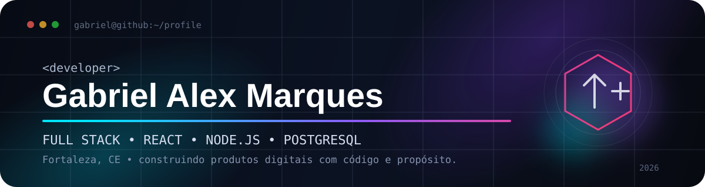

<h1 align="center">Olá, eu sou o Gabriel Alex 👋</h1>

<p align="center">
  <strong>Desenvolvedor Full Stack • React • Node.js • PostgreSQL</strong><br/>
  Fortaleza, Ceará — Brasil 🇧🇷
</p>

<p align="center">
  <a href="https://github.com/GabrielAlexS2?tab=followers">
    
  </a>
  <a href="https://github.com/GabrielAlexS2?tab=repositories">
    
  </a>
  <a href="https://gabrielalexs2.github.io/GabrielAlexS2/">
    
  </a>
</p>

---

## 👨‍💻 Sobre mim

```javascript
const gabriel = {
  nome: "Gabriel Alex Marques",
  localizacao: "Fortaleza, CE - Brasil",
  formacao: "Universidade Federal do Ceará",
  foco: ["Desenvolvimento Web", "Full Stack", "Sistemas e Produtos Digitais"],
  frontend: ["HTML", "CSS", "JavaScript", "React", "Next.js", "Tailwind CSS"],
  backend: ["Node.js", "Express.js", "Prisma ORM"],
  bancos: ["PostgreSQL", "MySQL", "IndexedDB"],
  ferramentas: ["Git", "GitHub", "Docker", "Vite", "WSL2", "Nginx"],
  interesses: ["SaaS", "PWA", "Automação", "UX", "Integrações", "Produtos com impacto"]
};
```

Desenvolvo aplicações web de ponta a ponta, com atenção tanto à experiência do usuário quanto à estrutura do backend. Tenho experiência com interfaces modernas, APIs, autenticação, bancos relacionais, PWA, Docker e integrações de pagamento.

Atualmente sigo evoluindo em arquitetura web, produtos SaaS e aplicações full stack mais completas.

---

## 🚀 Projetos em destaque

| Projeto | Descrição | Tecnologias |
|---|---|---|
| **MarketFlow / Sistema PDV** | PDV e estoque com arquitetura offline-first, fluxo de caixa, scanner e integração com PIX. | React, Node.js, Prisma, PostgreSQL, Dexie, PWA |
| **BarberPro CRM** | Sistema de agendamento para barbearias com autenticação por perfis e pagamentos PIX. | Next.js, Express, MySQL, JWT, Mercado Pago |
| **Inpacto Social** | Projeto que transforma valores financeiros em métricas sociais e usa dados públicos para contextualização. | HTML, CSS, JavaScript, API IBGE |
| **PDF Studio** | Editor web focado em documentos em formato A4. | JavaScript, HTML, CSS |
| **Auto-Magic** | Projeto de jogo em evolução com arquitetura orientada a sistemas e gerenciamento de fases. | JavaScript / Game Architecture |

<p align="center">
  <a href="https://github.com/GabrielAlexS2?tab=repositories">
    
  </a>
</p>

---

## 🛠️ Tech Stack

### Frontend
<p>
  
</p>

### Backend & Banco de Dados
<p>
  
</p>

### Ferramentas & Infra
<p>
  
</p>

---

## 📊 GitHub Analytics

<p align="center">
  
  
</p>

<p align="center">
  
</p>

<p align="center">
  
</p>

<p align="center">
  
  
</p>

<p align="center">
  
  
</p>

---

## 🏆 GitHub Trophies

<p align="center">
  
</p>

---

## 📈 Atividade

<p align="center">
  
</p>

---

## 🎓 Formação & evolução

- 🎓 Graduação na **Universidade Federal do Ceará**
- 🥇 Formação intensiva em tecnologia pela **Digital College / Geração Tech**
- 💻 Mais de 2 anos praticando programação e desenvolvimento web
- 📚 Estudos contínuos em Java, arquitetura web, backend, bancos de dados e desenvolvimento de produtos
- 🧩 Experiência com projetos reais envolvendo autenticação, pagamentos, PWA, Docker e integrações externas

---

## 💡 Atualmente estudando e construindo

```text
→ Arquitetura Full Stack
→ SaaS e produtos web comercializáveis
→ React / Next.js em aplicações maiores
→ Node.js e APIs REST
→ PostgreSQL e modelagem de dados
→ Docker e deploy
→ Java
→ Experiências web interativas com Three.js, WebGL e GSAP
```

---

## 🤝 Vamos nos conectar

<p align="center">
  <a href="mailto:bielgameplay807@gmail.com">
    
  </a>
  <a href="https://github.com/GabrielAlexS2">
    
  </a>
  <a href="https://gabrielalexs2.github.io/GabrielAlexS2/">
    
  </a>
</p>

<br/>

<p align="center">
  <i>"Código bom resolve problemas. Produto bom resolve problemas para pessoas."</i>
</p>

<p align="center">
  
</p>
